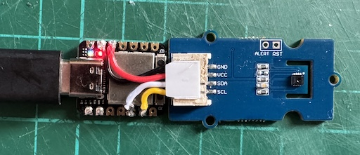

Firmware and hardware specification for a USB SHT35 temperature/humidity sensor.

### Hardware:

1. Purchase [I2C High Accuracy Temp&Humi Sensor](https://wiki.seeedstudio.com/Grove-I2C_High_Accuracy_Temp%2526Humi_Sensor-SHT35/) ([RS 184-5091](https://uk.rs-online.com/web/p/sensor-development-tools/1845091)) and [XIAO RP2040](https://www.seeedstudio.com/XIAO-RP2040-v1-0-p-5026.html) ([RS 250-0966](https://uk.rs-online.com/web/p/arduino-compatible-boards-kits/2500966)).

2. Wire as follows and cut the top from the wiring connector to reduce its height:



3. 3D print `shtstick_cap.step` and `shtstick_cover.step`.

4. Install firmware as described below.

5. Assemble electronics in case.

### Compilation/Installation

Requires a working installation of the Raspberry Pi Pico SDK.

Compile the firmware using

```
cd build
cmake ..
make
```

Boot the RP2040 into bootloader mode and copy the generated `shtstick.uf2` to the mounted directory.